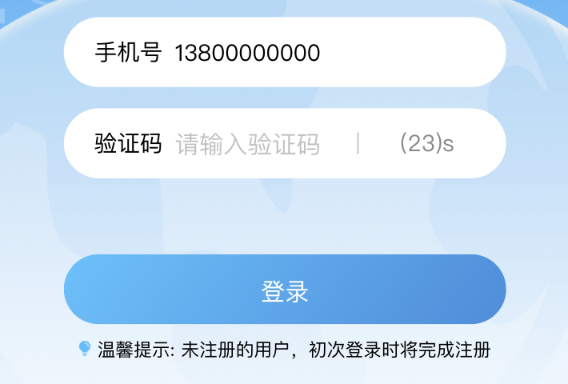

# Js-Forward 简介

Js-Forward是为了解决在渗透测试过程中所遇到的WEB流量加密而开发出的脚本工具

# Js-Forwad 设计背景

- 随着互联网安全的发展，对重要的业务系统的安全性要求也在逐渐提升，出现了大量用于加密流量的js，实现了客户端浏览器到服务器直接的参数加密。这个时候想要对渗透测试无疑相当于增加了难度，通常我们F12对其进行调试寻找加密过程密钥，解密流量后修改数据包再加密送往服务器，这个过程繁琐且效率低下，遇到轮询密钥交换等不固定密钥算法时还会更加复杂。
- 为此，Js-Forward被开发了出来，通过使用该工具，可以应对几乎所有的前端加密技术对渗透测试造成的困扰。
- 使用便捷。

# Js-Forwad 原理

- 浏览器在对参数进行加密时，通常会将需要加密的参数传入一个加密函数，返回密文。将服务器密文传入一个解密函数，返回明文，那么不管中间使用的是什么加密方式，总会有两个点可以进行修改，即加密函数入参与解密函数返回，此时加解密问题就变成了如何修改js运行过程参数的问题，到了这里思路逐渐明了。方法大致有两种：1、js hook 2、使用http请求将参数发送出来再外部进行修改，将修改后的返回值再替换原参数。
- 这里选择使用第二种，至于第一种感兴趣的小伙伴可以研究一下看是不是会更方便

# Js-Forward 使用方法

- 这里举例的其实已经属于比较复杂的类型，且不包含Js-Forward所需要的jquery，希望大家可以认真看完。

#### 一、输入手机号，点击发送验证码

#### 二、Burp正常抓包，发现流量是加密的，并且有summary、data、encelope三个参数

#### 三、通过前端JS的调试，寻找到加密函数点，这里可以发现summary、data、encelope都是由此而来，函数名称setInto

#### 四、要对burp做一些设置，使得burp可以截断js

#### 五、设置后的样子

#### 六、此时就可以启动Js-Forward了

#### 七、清除浏览器缓存，重新加载

#### 八、判断一下该应用是否使用的Jquery，例子中是不包含的，所以需要将Jquery手动添加进去，若已经引用了js则这一步可以省略

#### 九、burp慢慢找带有setInto的js，最终找到了

#### 十、在Js-Forward中输入要转发出来的参数名称，即data，会生成payload

#### 十一、将payload插入进要替换参数的位置（注意在这里setInto是动态加载的js所以是字符串，要将Js-Forward生成的payload的双引号转义一下" -> \"）

#### 十二、将js放行，此时js便会缓存在浏览器中，后续就算不挂代理，burp依旧可以抓取带该数据包

#### 十三、解密成功

# 后记
- 遇到需要修改多个参数的，只需要按照上面的方法多生成几条payload插入对应的位置即可。
- 此项目只针对WEB应用，APP解密工具涉及部分金融行业以及阿里系，暂不公开。
